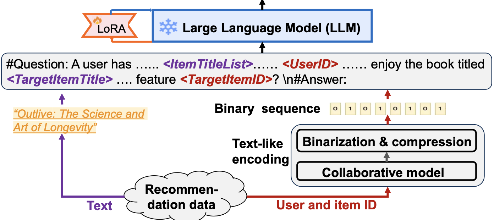
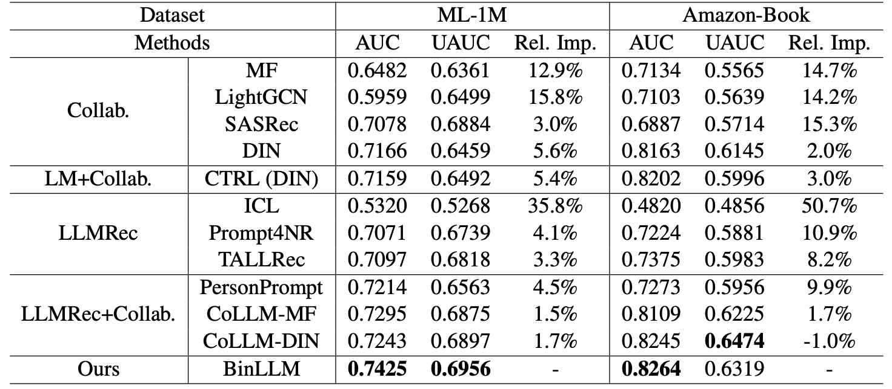

# Text-like Encoding of Collaborative Information in Large Language Models for Recommendation

#
Diego Alejandro Quezada Campos
Diego Ignacio Campusano Schialer
Nicolás Javier Espinoza Silva

---
# Contexto

* Creciente interés en adaptar modelos de lenguaje grandes (LLMs) para sistemas de recomendación (LLMRec)
* La información colaborativa es crucial para modelar los intereses de los usuarios, pero difiere en modalidad de los datos textuales

---
# Marco teórico

TODO

* LLM
* RecSys
* LLMRec

---
# Problema

Cómo codificar la información colaborativa en LLMs para recomendaciones

---
# Estado del arte

## Estrategia 1

* Incorporar tokens adicionales en LLMs para representar usuarios y productos, ajustando los datos de interacción para capturar información colaborativa en los embeddings ([Zheng et al., 2024](https://arxiv.org/abs/2311.09049); [Hua et al., 2023](http://dx.doi.org/10.1145/3624918.3625339))
* Altera el espacio generativo del LLM, potencialmente comprometiendo las funcionalidades originales
* Baja eficacia debido a la naturaleza de bajo rango de la información, lo que genera redundancia en la tokenización

---

## Estrategia 2

* Usar un modelo externo de factores latentes para capturar la información colaborativa y luego mapearla al espacio de embeddings de los tokens, evitando la necesidad de aprenderlos desde cero ([Zhang et al., 2024](https://arxiv.org/abs/2310.19488); [Li et al., 2023](https://arxiv.org/abs/2312.02443); [Liao et al., 2024](https://arxiv.org/abs/2312.02445))
* Es efectivo, pero requiere entrenar un modelo adicional

---
# Contribución

Tomando inspiración en:

* La viabilidad de binarizar embeddings colaborativos sin comprometer el rendimiento ([Tan et al., 2020](https://arxiv.org/abs/2003.01917))
* LLMs pueden realizar operaciones a nivel de bits de forma natural o después de un ajuste por instrucciones ([Savelka et al., 2023](http://dx.doi.org/10.1145/3568813.3600142))

La contribución de los autores es:

* **BinLLM**: un enfoque innovador de LLMRec que integra información colaborativa en los LLMs al codificar los embeddings colaborativos como secuencias binarias.

---
# BinLLM

  
  

---

## Plantilla de prompt

#Question: A user has given high ratings to the following books: ``ItemTitleList``. Additionally, we have information about the user's preferences encoded in the feature ``UserID``. Using all available information, make a prediction about whether the user would enjoy the book titled ``TargetItemTitle`` with the feature ``TargetItemID``? Answer with "Yes" or "No".
#Answer:

---

## Codificación de Información Colaborativa

Dado un usuario $u$ y un item $i$, obtendremos sus embeddings a través de un modelo $f$:

$$
e_u = f (u; \theta)
$$

$$
e_i = f (i; \theta)
$$

Para binarizar los embeddings, se utiliza una capa totalmente conectada:

$$
\bm{h}_u = sign(\sigma(We_u + b))
$$

$$
\bm{h}_i = sign(\sigma(We_i + b))
$$

---

En donde:

* $e_u \in \mathcal{R}^d$
* $e_i \in \mathcal{R}^d$
* $\bm{h}_u \in \{0, 1\}^d$
* $\bm{h}_i \in \{0, 1\}^d$
* $W \in \mathcal{R}^{d \times d}$
* $b \in \mathcal{R}^d$.

---

## Configuración

* Tarea: Predicción de click
* Conjunto de datos: MovieLens-1M y Amazon-Book
* LLM: Vicuna-7B
* Largo representación binaria: 32
* Métrica de evaluación: AUC
* Función de activación $\sigma$: Tanh
* FUnción de pérdida: Binary cross-entropy

---

## Entrenamiento

TODO
... Explicar cómo se usa LoRa

---

## Inferencia

Considerando un prompt $p$, la predicción se puede formular como:

$$
\hat{y} = LLM_{\hat{\Phi} + \Phi'}(p)
$$

En donde $\hat{\Phi}$ denota los parámetros del LLM y $\Phi'$ los del módulo LoRA.

---

# Evaluación

  
  

---
# Experimentos

---
# Conclusiones

---
# Referencias

1. Zheng, B., Hou, Y., Lu, H., Chen, Y., Zhao, W. X., Chen, M., & Wen, J.-R. (2024). *Adapting Large Language Models by Integrating Collaborative Semantics for Recommendation*. arXiv. https://arxiv.org/abs/2311.09049
2. Hua, W., Xu, S., Ge, Y., & Zhang, Y. (2023). *How to Index Item IDs for Recommendation Foundation Models*. In *Proceedings of the Annual International ACM SIGIR Conference on Research and Development in Information Retrieval in the Asia Pacific Region* (SIGIR-AP '23), 195–204. ACM. https://doi.org/10.1145/3624918.3625339

---
3. Zhang, Y., Feng, F., Zhang, J., Bao, K., Wang, Q., & He, X. (2024). *CoLLM: Integrating Collaborative Embeddings into Large Language Models for Recommendation*. arXiv. https://arxiv.org/abs/2310.19488
4. Li, X., Chen, C., Zhao, X., Zhang, Y., & Xing, C. (2023). *E4SRec: An Elegant Effective Efficient Extensible Solution of Large Language Models for Sequential Recommendation*. arXiv. https://arxiv.org/abs/2312.02443
5. Liao, J., Li, S., Yang, Z., Wu, J., Yuan, Y., Wang, X., & He, X. (2024). *LLaRA: Large Language-Recommendation Assistant*. arXiv. https://arxiv.org/abs/2312.02445

---

6. Tan, Q., Liu, N., Zhao, X., Yang, H., Zhou, J., & Hu, X. (2020). *Learning to Hash with Graph Neural Networks for Recommender Systems*. arXiv. https://arxiv.org/abs/2003.01917  

7. Savelka, J., Agarwal, A., An, M., Bogart, C., & Sakr, M. (2023). *Thrilled by Your Progress! Large Language Models (GPT-4) No Longer Struggle to Pass Assessments in Higher Education Programming Courses*. Proceedings of the 2023 ACM Conference on International Computing Education Research V.1. ACM. http://dx.doi.org/10.1145/3568813.3600142  
